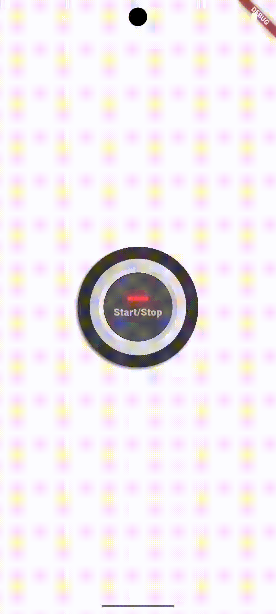

<a href="https://reposis.com"></a>

# Flutter Realistic Buttons

This package was created to make it easy to add realistic push buttons with LED status indicators to your Flutter projects.



## Installation

```bash
$ flutter pub add realistic_button
```

## Usage

```dart
RealisticButton(
  size: 180,
  initialValue: _buttonStatus,
  onchange: (val) {
    setState(() {
      _buttonStatus = val;
    });
  },
  label: "Start/Stop",
)
```

## Contributing

Pull requests are welcome. For major changes, please open an issue first
to discuss what you would like to change.

Please make sure to update tests as appropriate.

## License

[GNU GPL v3.0](https://choosealicense.com/licenses/gpl-3.0/)
